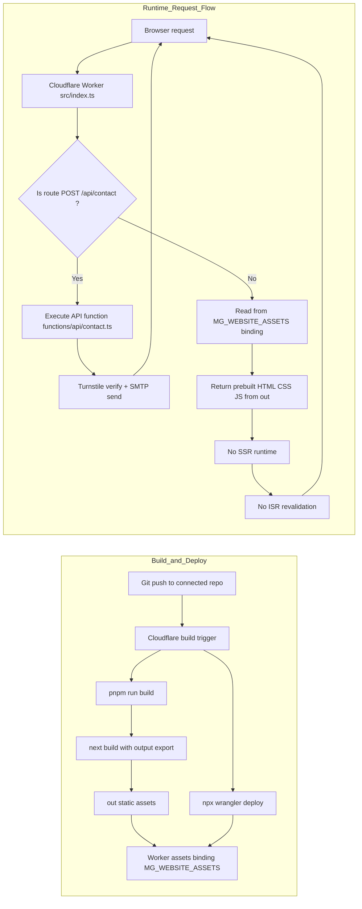

# Magistrala Website

This is a Next.js application generated with
[Create Fumadocs](https://github.com/fuma-nama/fumadocs).

It is a Next.js app with [Static Export](https://nextjs.org/docs/app/guides/static-exports) configured.

Run development server:

```bash
npm run dev
# or
pnpm dev
# or
yarn dev
```

Open http://localhost:3000 with your browser to see the result.

## Deployment Strategy (Current)

This repository intentionally uses:

- **Next.js static export** for all pages (`out/`)
- **Cloudflare Worker assets binding** to serve those exported files
- **A single Worker route handler** for contact submissions (`POST /api/contact`)

This keeps runtime behavior simple: almost everything is static content, and only the contact endpoint runs custom server-side logic.

### How it works in this repo

- `next.config.mjs` uses `output: "export"` so `next build` generates static files in `out/`.
- `wrangler.jsonc` binds `./out` as Worker assets via `MG_WEBSITE_ASSETS`.
- `src/index.ts` is the Worker entrypoint:
  - only `/api/contact` (POST) is handled by `functions/api/contact.ts`
  - every other route is served from `env.MG_WEBSITE_ASSETS.fetch(request)`

**All pages are static export output (pure HTML/CSS/JS from `out/`). There is no SSR/ISR runtime. Only the contact endpoint runs Worker function code.**

### Deployment trigger

Deployments are handled by Cloudflare reading from the connected Git repository directly (no external CI pipeline is required).

### Cloudflare build settings (Dashboard)

- Build command: `pnpm run build`
- Deploy command: `npx wrangler deploy`
- Version command: `npx wrangler versions upload`
- Root directory: `/`

These settings match the current static export + Worker assets deployment model in this repository.

### Mermaid architecture



### Trade-off comparison

|                     | Static export + Worker assets (current) | OpenNext                                  |
|---------------------|------------------------------------------|-------------------------------------------|
| Request flow        | Worker router + assets binding (`out/`) | Full Next.js runtime in Worker            |
| Rendering model     | Fully static pages                       | SSR/ISR/dynamic rendering supported       |
| Contact endpoint    | Custom Worker handler (`/api/contact`)   | Native Next.js API routes                 |
| Complexity          | Lower (small routing surface)            | Higher (full Next runtime surface)        |
| Performance profile | Fast static delivery via assets/CDN      | More runtime work per request             |
| Cost profile        | Lower compute; mostly static traffic     | Higher compute for app runtime paths      |
| Best fit            | Static-first marketing/docs sites        | Runtime-heavy or SSR-first applications   |

### Why OpenNext sends every request through a Worker

OpenNext wraps the full Next.js server runtime inside a single Worker. It does not selectively split static and dynamic routes at runtime.

Even for a static page request, traffic reaches the Worker first, then the Worker decides whether to serve from cache/KV/assets or render.

That design is required because Next.js runtime behavior is a unified pipeline:

- routing
- middleware
- headers/redirects
- ISR revalidation
- API routes

Because these features are coupled in one server runtime, OpenNext emulates that entire pipeline in a Worker.

### Decision for current requirements

We choose **static export + Worker assets + one Worker API route** (instead of OpenNext) because the current requirement is:

- a mostly static marketing/docs website
- one dynamic endpoint only (`POST /api/contact`)
- low runtime overhead and low operational complexity

Given this requirement, OpenNext would run the full Next.js server pipeline on every request, which adds runtime overhead where no dynamic rendering is needed.

The current architecture keeps page delivery static-first and limits custom Worker logic to the contact API path.

Current downside in this deployment model: the contact API is still a public endpoint (`/api/contact`), so without bot protection it can be abused (spam/automation).

To mitigate that, we protect the endpoint with **Cloudflare Turnstile**:

- the client sends a Turnstile token (`cf-turnstile-response`)
- the Worker contact handler verifies it server-side using `TURNSTILE_SECRET_KEY`
- invalid or missing tokens are rejected with `403`

This gives lightweight abuse protection while keeping the static-first architecture.

If future requirements add SSR-heavy pages, route-level middleware needs, or broader server-side logic, OpenNext can be revisited.

## Environment Variables

To enable the contact form on local Worker dev (`npm run cf:dev`), create a `.dev.vars` file:

```bash
cp .dev.vars.example .dev.vars
```

Then configure the following environment variables:

### Variable Scope (Build vs Runtime)

Turnstile in this project uses two different environment scopes:

| Variable | Scope | Configure in Cloudflare | Used in code | Purpose |
|----------|-------|--------------------------|--------------|---------|
| `NEXT_PUBLIC_TURNSTILE_SITE_KEY` | Build-time variable | Build variables (repo-integrated Worker build settings) | `app/(home)/contact/contact-form.tsx` | Renders the Turnstile widget on the contact page and sends token with form payload |
| `TURNSTILE_SECRET_KEY` | Runtime secret | Worker runtime secrets/variables | `functions/api/contact.ts` | Verifies `cf-turnstile-response` token via Cloudflare siteverify API |

`NEXT_PUBLIC_*` values are embedded into the static frontend at build time.  
`TURNSTILE_SECRET_KEY` is used only on the server-side Worker at request runtime.

### Required Variables

```env
# SMTP Configuration for Contact Form
SMTP_HOST=smtp.example.com          # SMTP server hostname (e.g., smtp.gmail.com, smtp.sendgrid.net)
SMTP_PORT=587                        # SMTP server port (587 for TLS, 465 for SSL)
SMTP_SECURE=false                    # Use secure connection (true for SSL on port 465, false for TLS on port 587)
SMTP_USER=your-email@example.com     # SMTP authentication username
SMTP_PASS=your-password              # SMTP authentication password or app-specific password
MAIL_FROM_EMAIL=noreply@magistrala.absmach.eu  # Sender email (or use SMTP_FROM for backward compatibility)
TEAM_CONTACT_EMAIL=contact@magistrala.absmach.eu # Recipient email (or use CONTACT_EMAIL for backward compatibility)
```

### Optional Variables

```env
# Build-time variable (frontend)
NEXT_PUBLIC_TURNSTILE_SITE_KEY=your-turnstile-site-key

# Runtime variables (Worker)
# Base URL of your website (used in email templates)
NEXT_PUBLIC_BASE_URL=https://magistrala.absmach.eu
MG_LOGO_URL=https://example.com/logo.png
TURNSTILE_SECRET_KEY=your-turnstile-secret
```

For deployed environments, store secrets in Cloudflare Worker settings (or with `wrangler secret put`) and keep non-sensitive defaults in `wrangler.jsonc`.

### Contact API Protection (Cloudflare Turnstile)

`POST /api/contact` supports bot protection using Cloudflare Turnstile.

- The frontend includes `cf-turnstile-response` in the request payload.
- The Worker contact handler verifies that token against Cloudflare's siteverify API when `TURNSTILE_SECRET_KEY` is configured.
- If verification fails (or token is missing), the function returns `403`.
- If `TURNSTILE_SECRET_KEY` is not set, Turnstile verification is skipped (useful for local development only).

For production:

- configure `NEXT_PUBLIC_TURNSTILE_SITE_KEY` as a Cloudflare build variable
- configure `TURNSTILE_SECRET_KEY` as a Cloudflare Worker runtime secret

### How to Create Turnstile Keys

1. Open Cloudflare Dashboard -> `Turnstile` -> `Add widget`.
2. Create a widget for your domain (for example, `magistrala.absmach.eu`) using `Managed` mode.
3. Copy the generated keys:
   - **Site Key** -> set as build variable `NEXT_PUBLIC_TURNSTILE_SITE_KEY`
   - **Secret Key** -> set as runtime secret `TURNSTILE_SECRET_KEY`
4. Redeploy so the frontend build includes the site key.

### Local Development Notes

- Set `TURNSTILE_SECRET_KEY` in `.dev.vars` for Worker runtime verification.
- Set `NEXT_PUBLIC_TURNSTILE_SITE_KEY` in your build environment (for example shell export or `.env.local`) before running `pnpm run build` / `pnpm run cf:dev`.
- If no Turnstile keys are configured, the widget is not rendered and server verification is skipped.

### SMTP Provider Examples

**Gmail:**
```env
SMTP_HOST=smtp.gmail.com
SMTP_PORT=587
SMTP_SECURE=false
SMTP_USER=your-email@gmail.com
SMTP_PASS=your-app-specific-password
```
Note: For Gmail, you need to create an [App Password](https://support.google.com/accounts/answer/185833) instead of using your regular password.

**SendGrid:**
```env
SMTP_HOST=smtp.sendgrid.net
SMTP_PORT=587
SMTP_SECURE=false
SMTP_USER=apikey
SMTP_PASS=your-sendgrid-api-key
```

**AWS SES:**
```env
SMTP_HOST=email-smtp.us-east-1.amazonaws.com
SMTP_PORT=587
SMTP_SECURE=false
SMTP_USER=your-ses-smtp-username
SMTP_PASS=your-ses-smtp-password
```

## Explore

In the project, you can see:

- `lib/source.ts`: Code for content source adapter, [`loader()`](https://fumadocs.dev/docs/headless/source-api) provides the interface to access your content.
- `lib/layout.shared.tsx`: Shared options for layouts, optional but preferred to keep.

| Route                       | Description                                            |
| --------------------------- | ------------------------------------------------------ |
| `app/(home)`                | The route group for your landing page and other pages. |
| `app/(home)/contact`        | Contact form page with email functionality.            |
| `app/docs`                  | The documentation layout and pages.                    |
| `app/api/search/route.ts`   | The Route Handler for search.                          |
| `functions/api/contact.ts`  | Worker contact handler used by `/api/contact`.         |

### Fumadocs MDX

A `source.config.ts` config file has been included, you can customise different options like frontmatter schema.

Read the [Introduction](https://fumadocs.dev/docs/mdx) for further details.

## Learn More

To learn more about Next.js and Fumadocs, take a look at the following
resources:

- [Next.js Documentation](https://nextjs.org/docs) - learn about Next.js
  features and API.
- [Learn Next.js](https://nextjs.org/learn) - an interactive Next.js tutorial.
- [Fumadocs](https://fumadocs.dev) - learn about Fumadocs
