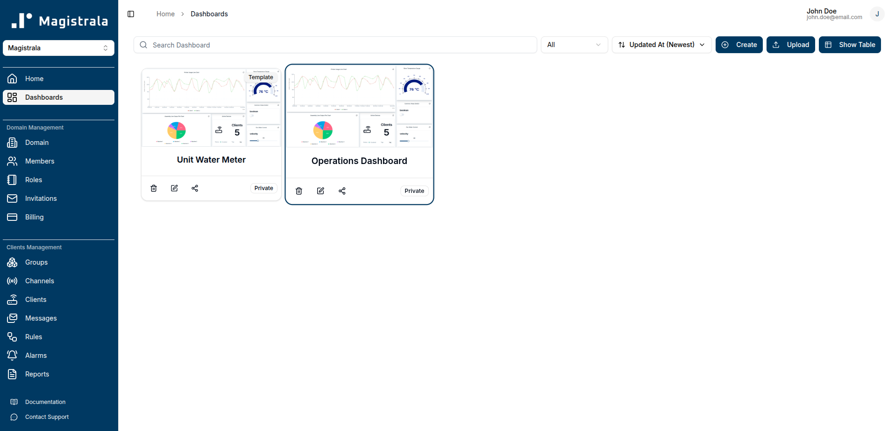

Dashboards are a powerful feature in Magistrala that allow you to build and customize real-time visualizations of your IoT data. Using a variety of widgets — charts, gauges, maps, data cards, and control elements — you can tailor each dashboard to your specific monitoring and operational needs.

Each dashboard can be populated with multiple widgets drawing from different data sources (clients,channels or groups), giving you a comprehensive view across your IoT system.

Magistrala offers two types of dashboards:

### Dashboards

A **dashboard** connects directly to specific data sources in your domain. You configure each widget with explicit data sources, making it ideal for personal or team-level views of known devices and data streams.

For instructions on creating, editing, sharing, and managing dashboards, see the [Dashboard Guide](dashboards).

### Templates

A **template** is a dashboard with abstract data sources. Instead of selecting specific entities, each widget is configured using **tags**. When a domain member views a template that has been shared with them, the system automatically resolves each tag to the entity assigned to that user — so the same template can display different data for different users, all within the same layout.

Templates are particularly useful for multi-user deployments, such as:

- **Customer portals** — each customer sees a dashboard populated with their own devices and data streams, without requiring a separate dashboard per customer.
- **Field technician views** — each technician sees readings from the equipment assigned to them, using a single shared template.
- **Facility or zone monitoring** — users assigned to a specific floor or area see data from the entities tagged for their location.

> Templates can only be created by **domain admins**. For full details on creating, configuring, and sharing templates, see the [Templates Guide](templates).
