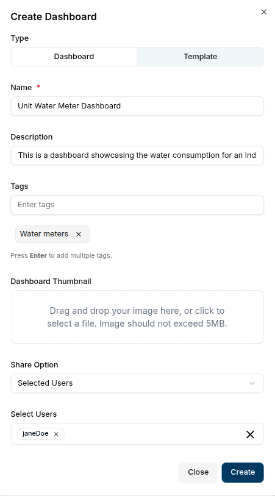
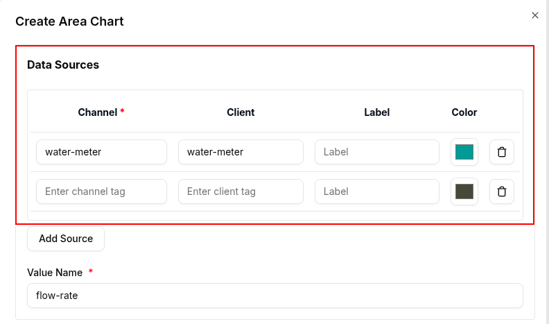
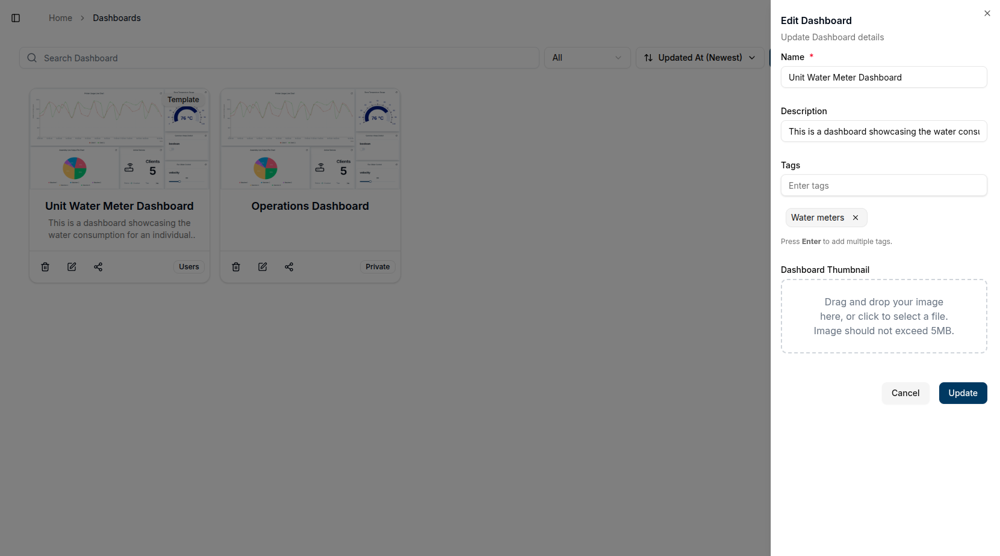
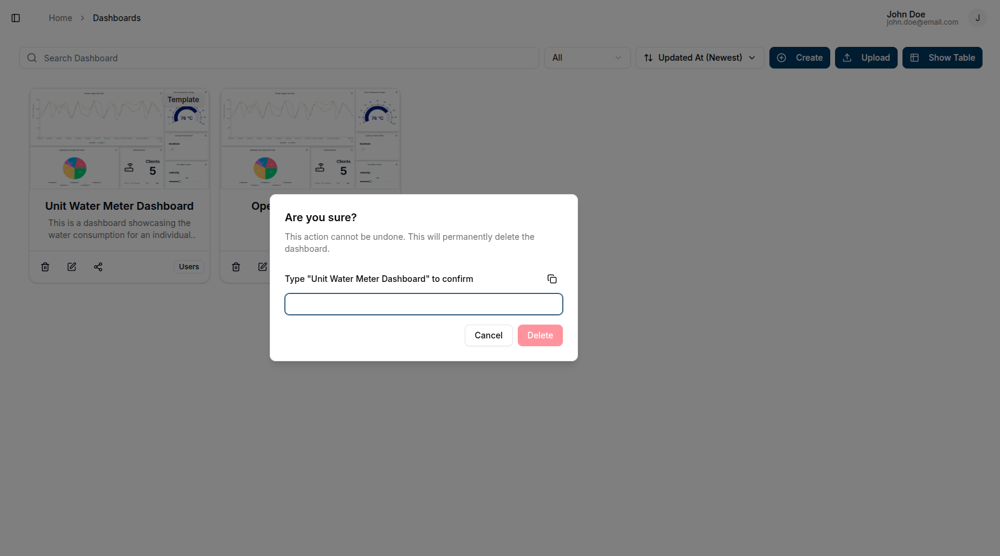
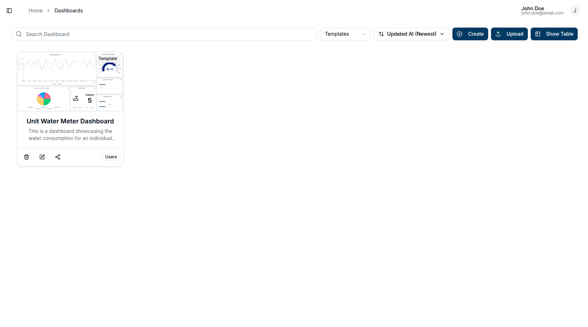

### What are Templates?

Templates are dashboards with **abstract data sources**. Instead of binding each widget to a specific channel or client, you configure widgets using **tags**. When a domain member views a shared template, the system resolves each tag to the entity assigned to that user — so the same template layout serves multiple users, each seeing their own data.

This makes templates ideal for any scenario where many users need an identical dashboard layout but with data from their own assigned devices.

### Use Cases

#### Customer Portals

Enterprise customers often need a self-service view of their own equipment and data. With templates, a domain admin creates a single dashboard layout once. Each customer is then assigned the entities (clients, channels) tagged appropriately, and when they log in they see a fully populated dashboard with their data — without any additional setup.

> Magistrala provides **custom customer portals** for enterprise users built on top of this templates feature. Contact us to learn more.

#### Field Technician Dashboards

When you have a team of technicians, each responsible for different equipment, templates let each technician log in and immediately see readings, alerts, and controls for the devices assigned to them — using one shared template rather than maintaining a separate dashboard per technician.

#### Facility and Zone Monitoring

For deployments across multiple floors, buildings, or geographic zones, you can tag entities by location (e.g., `floor-3`, `building-a`). Assigning the relevant entities to each facility manager means they see only their zone's data when they open the shared template.

### How Tag Resolution Works

When a domain member opens a shared template, the system resolves data sources for each widget as follows:

1. The widget is configured with a **tag** (e.g., `temperature-sensor`).
2. The system looks up entities (clients, channels) assigned to the viewing user that carry that tag.
3. The matching entity is used as the data source for that widget.

> **Important:** Each user should have **at most one entity of a given type** with a particular tag. If multiple entities match, the system uses the **first entity** returned in the list. The domain admin is responsible for ensuring tags are applied correctly and unambiguously.

### Prerequisites

Before sharing a template, the domain admin must ensure:

- The relevant entities (clients, channels) have the correct tags applied.
- Those entities are **assigned to the appropriate users** in the domain.
- Each user has **only one entity per type** with any given tag used in the template.

> See the [Members Guide](../domain-management/domain#domain-members) for instructions on assigning entities to users.

### Creating a Template

Only **domain admins** can create templates.

Navigate to the **Dashboards** tab and click `+ Create`. In the create dialog, use the **type switch** at the top to select **Template** instead of Dashboard.

The following fields are available:

| Field            | Required | Description                                                                         |
| ---------------- | -------- | ----------------------------------------------------------------------------------- |
| **Name**         | Yes      | A unique name for the template                                                      |
| **Description**  | No       | A short description of the template's purpose                                       |
| **Tags**         | No       | One or more tags for categorizing the template                                      |
| **Thumbnail**    | No       | An image to display on the template card                                            |
| **Share Option** | No       | Controls who can view this template (see [Sharing a Template](#sharing-a-template)) |

### Configuring Template Widgets

Adding widgets to a template works the same way as in a regular dashboard (see [Widget Guide](widgets)), with one key difference: **data sources are specified by tag instead of by selecting a specific entity**.

When adding or editing a widget in a template:

1. Open the template and enable **Edit Mode**.
2. Click `Add Widget` or click the `pencil` icon on an existing widget.
3. In the data source section, enter the **tag** of the entity whose data you want to display.

The tag you enter must match a tag on the entity assigned to each user who will view the template.

### Sharing a Template

A template must be shared with domain members for them to see it when they view the domain. The same share options available for dashboards apply to templates:

- **None** — visible only to you (the admin who created it)
- **Domain Members** — all domain members can view the template with their own data
- **Selected Users** — only the users you choose can view the template

To update the share state, click the `Share` icon on the template card and select the desired option.

### Managing Templates

Templates support the same management operations as dashboards:

#### Edit a Template

Click the `pencil` icon on the template card to open the edit panel. You can update the **name**, **description**, **tags**, and **thumbnail**.

#### Delete a Template

Click the `trash` icon on the template card. A confirmation prompt will appear — type the **template name** exactly as shown to confirm deletion.

#### Unshare a Template

To revoke access, click the `Share` icon on the template card and change the share option to **None** (private) or adjust the **Selected Users** list.

### Filtering Templates in the Listing

On the Dashboards listing page, use the **Templates** tab filter to view only templates. You can also search by name and apply sort options.

> See the [Dashboard Guide](dashboards#filter-and-sort-dashboards) for full details on filtering and sorting.

