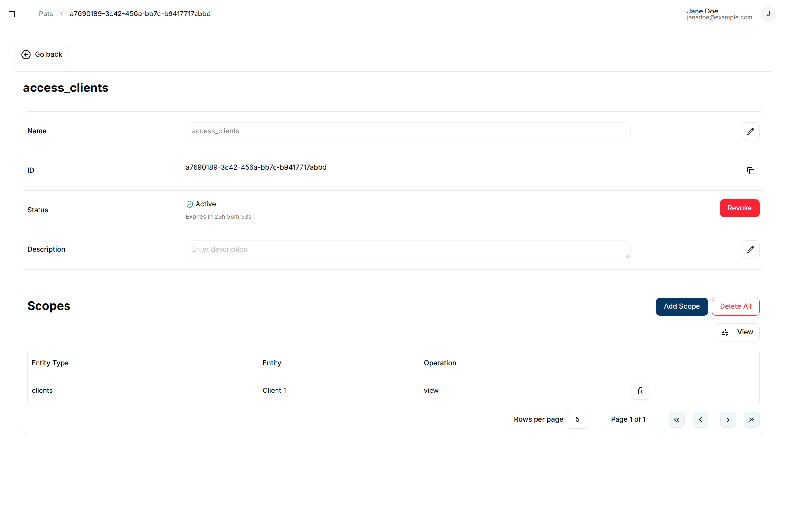
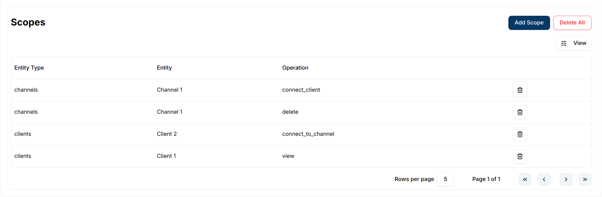

## Overview

Personal access tokens are an alternative to using bearer tokens to perform various operations on the entities.
To access personal access tokens (PATs) click on `Personal Access Token` tab on the `user profile picture` or `avatar` at the top right.

## Create a PAT

To create a PAT, click on the `+ Create PAT` button.

This action redirects the user to the PAT creation page, where required details can be provided. The **name** should be a recognizable label for the token, and the **duration** sets the period for which the token will remain valid. Additionally, the user can enter an optional **description** and define **scopes**, which specify the operations the PAT is allowed to perform. Each PAT can be restricted to specific operations on particular entities, providing fine-grained access control.

Available scope entities are **Clients**, **Channels**, **Groups**, and **Domain**. Each entity type exposes a distinct set of operations:

#### Clients

| Operation                  | Description                              |
| -------------------------- | ---------------------------------------- |
| `view`                     | View a client                            |
| `update`                   | Update client information                |
| `update_tags`              | Update client tags                       |
| `update_secret`            | Update client secret/credentials         |
| `enable`                   | Enable a client                          |
| `disable`                  | Disable a client                         |
| `delete`                   | Delete a client                          |
| `set_parent_group`         | Assign a parent group to a client        |
| `remove_parent_group`      | Remove the parent group from a client    |
| `connect_to_channel`       | Connect a client to a channel            |
| `disconnect_from_channel`  | Disconnect a client from a channel       |

#### Channels

| Operation             | Description                              |
| --------------------- | ---------------------------------------- |
| `view`                | View a channel                           |
| `update`              | Update channel information               |
| `update_tags`         | Update channel tags                      |
| `enable`              | Enable a channel                         |
| `disable`             | Disable a channel                        |
| `delete`              | Delete a channel                         |
| `set_parent_group`    | Assign a parent group to a channel       |
| `remove_parent_group` | Remove the parent group from a channel   |
| `connect_client`      | Connect a client to the channel          |
| `disconnect_client`   | Disconnect a client from the channel     |

#### Groups

| Operation                    | Description                                  |
| ---------------------------- | -------------------------------------------- |
| `view`                       | View a group                                 |
| `update`                     | Update group information                     |
| `update_tags`                | Update group tags                            |
| `enable`                     | Enable a group                               |
| `disable`                    | Disable a group                              |
| `delete`                     | Delete a group                               |
| `retrieve_group_hierarchy`   | Retrieve the group hierarchy                 |
| `add_parent_group`           | Assign a parent group                        |
| `remove_parent_group`        | Remove the parent group                      |
| `add_children_groups`        | Add child groups                             |
| `remove_children_groups`     | Remove specific child groups                 |
| `remove_all_children_groups` | Remove all child groups                      |
| `list_children_groups`       | List child groups                            |
| `set_child_client`           | Assign a client as a child of the group      |
| `remove_child_client`        | Remove a client from the group               |
| `set_child_channel`          | Assign a channel as a child of the group     |
| `remove_child_channel`       | Remove a channel from the group              |

#### Domain

The **Domain** entity scope is automatically locked to the current domain.

| Operation                | Description                              |
| ------------------------ | ---------------------------------------- |
| `create`                 | Create a new domain                      |
| `update`                 | Update domain information                |
| `read`                   | Read domain details                      |
| `enable`                 | Enable the domain                        |
| `disable`                | Disable the domain                       |
| `list`                   | List domains                             |
| `send_invitation`        | Send a domain invitation                 |
| `list_invitation`        | List invitations sent by the user        |
| `list_domain_invitation` | List all invitations for the domain      |
| `delete_invitation`      | Delete a domain invitation               |
| `create_clients`         | Create clients within the domain         |
| `list_clients`           | List clients in the domain               |
| `create_channels`        | Create channels within the domain        |
| `list_channels`          | List channels in the domain              |
| `create_groups`          | Create groups within the domain          |
| `list_groups`            | List groups in the domain                |

#### Rules

| Operation              | Description                                      |
| ---------------------- | ------------------------------------------------ |
| `create`               | Create a rule                                    |
| `list`                 | List rules                                       |
| `view`                 | View a rule                                      |
| `update`               | Update rule configuration                        |
| `update_tags`          | Update rule tags                                 |
| `update_schedule`      | Update rule schedule                             |
| `enable`               | Enable a rule                                    |
| `disable`              | Disable a rule                                   |
| `delete`               | Delete a rule                                    |
| `alarm_assign`         | Assign an alarm to a user                        |
| `alarm_acknowledge`    | Acknowledge an alarm                             |
| `alarm_resolve`        | Resolve an alarm                                 |

> **Note:** Alarm-related permissions apply to all alarms linked to the selected rules.

#### Reports

| Operation              | Description                                      |
| ---------------------- | ------------------------------------------------ |
| `create`               | Create a report                                  |
| `list`                 | List reports                                     |
| `generate`             | Generate a report                                |
| `view`                 | View a report                                    |
| `update`               | Update report configuration                      |
| `update_schedule`      | Update report schedule                           |
| `enable`               | Enable a report                                  |
| `disable`              | Disable a report                                 |
| `delete`               | Delete a report                                  |
| `update_template`      | Update the report template                       |
| `view_template`        | View the report template                         |
| `delete_template`      | Delete the report template                       |

## View a PAT

After a PAT is created, the user is redirected to the PAT detail page. Alternatively, the user can view an existing PAT by clicking on the row or the `View` button in the row actions.

Upon creation, the PAT secret is displayed **once**, allowing the user to copy it. This secret will not be shown again once the page is reloaded.

## Manage scopes

### Add a scope

To add a new scope to an existing PAT, the user can click the `Add Scope` button. This allows the user to define additional permissions for the token.

### Delete a scope

The user can delete a specific scope from a PAT by clicking the `trash` icon in the scopes table.
To remove all scopes associated with a PAT, the user can click the `Delete All` button.

## Revoke a PAT

To revoke a PAT, click on the `Revoke` button located in the status row of the PAT detail page.  
Once a PAT is revoked, it becomes inactive and can no longer be used to perform any of the scoped operations.

## Regenerate a PAT

After revocation, the user can regenerate the PAT by clicking the `Regenerate` button. A dialog will appear, allowing the user to select a new validity duration. This creates a new secret while preserving all other PAT details such as the name, description, and scopes.

Expired tokens can also be regenerated. To do this, the user should navigate to the PATs page and change the status filter to **Expired** to view all expired tokens.

The user must then click on the expired PAT to view its details, and from there, click the `Regenerate` button. A dialog will appear, allowing the user to select a new duration. This process reactivates the PAT and generates a new secret, while maintaining the original configuration.

## Delete a PAT

The user can delete an individual PAT by clicking `Delete` in the row actions.

To remove all PATs, the user can click the `Delete All` button located on the PATs table.
