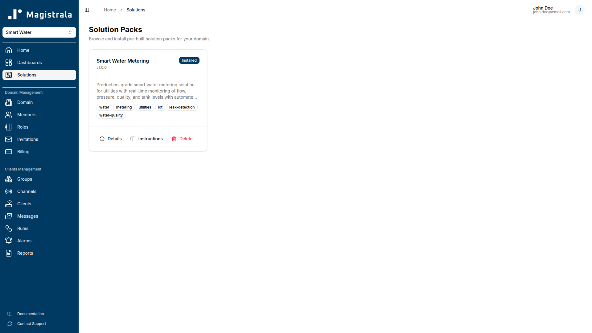
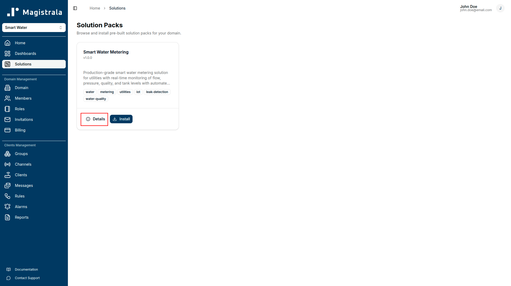
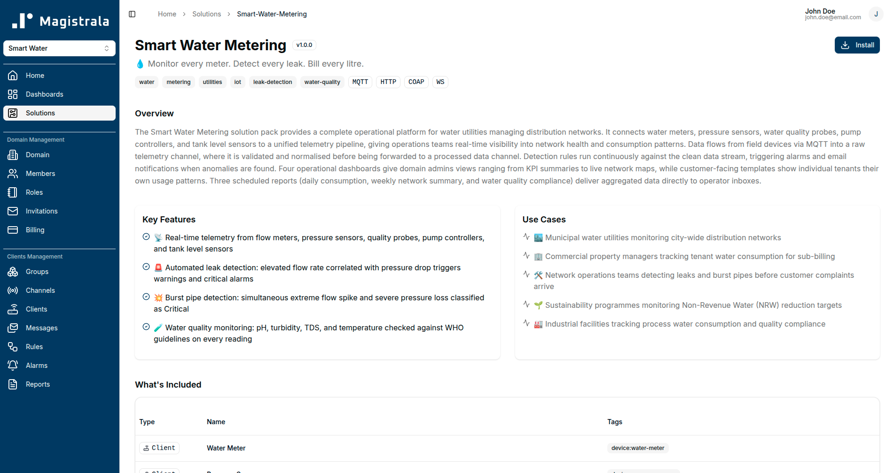
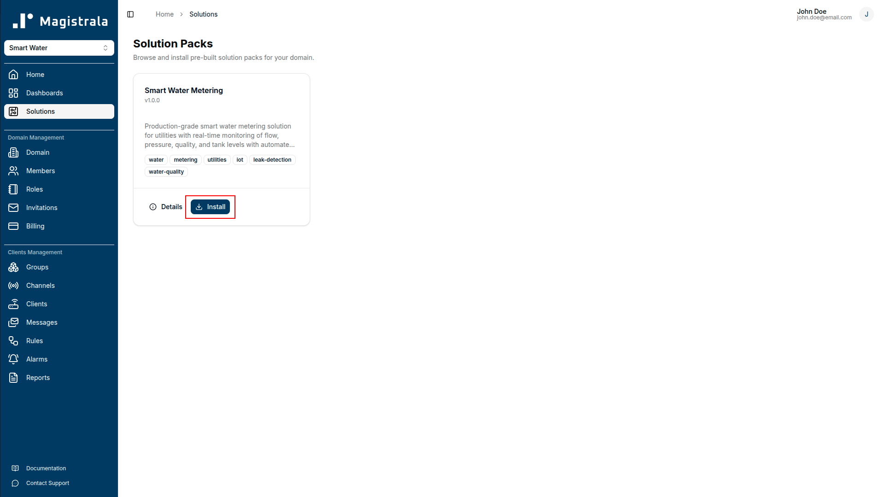
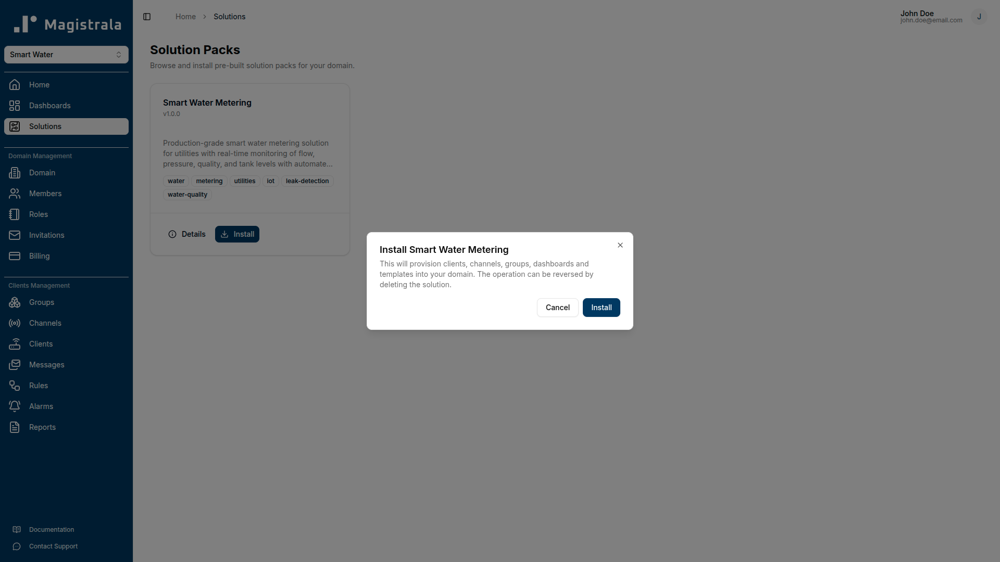
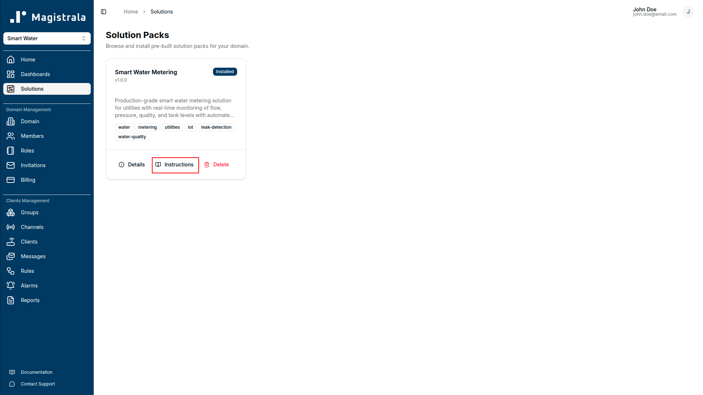
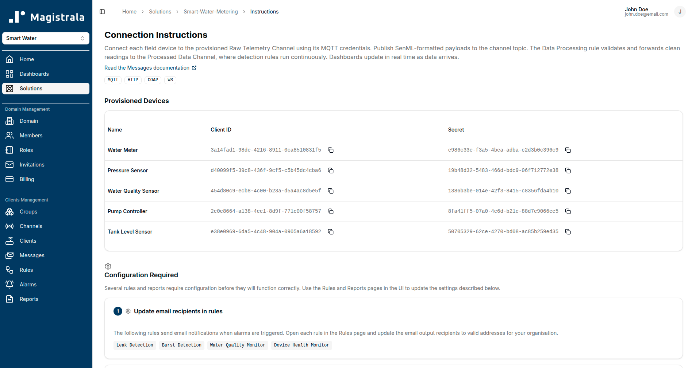
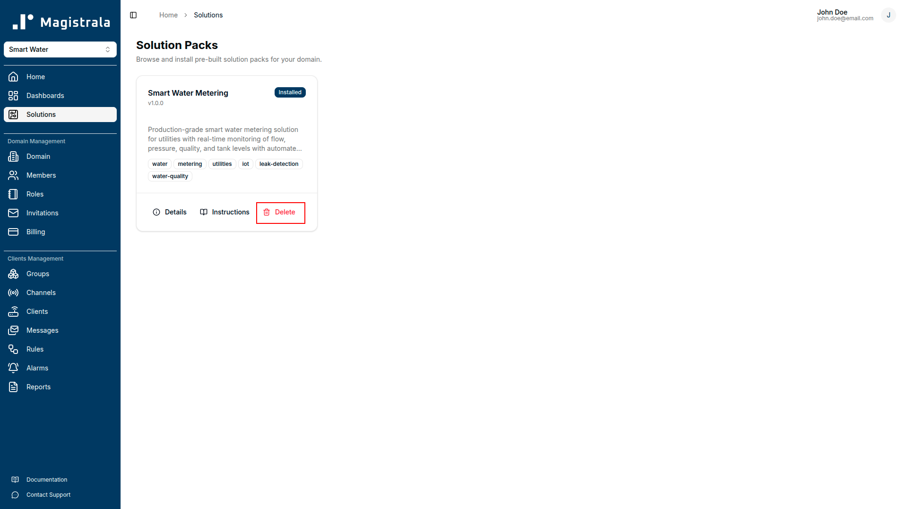
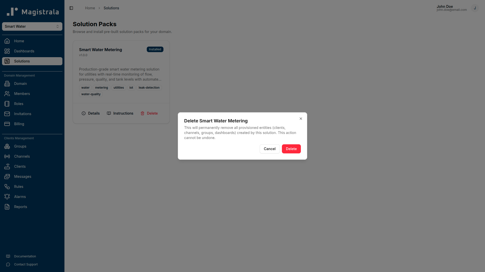

Solution packs are ready-made IoT solutions that you can deploy instantly from the Magistrala UI. Each pack bundles every entity required to run a real-world use case - clients, channels, groups, rules, dashboards, templates, and reports - so you go from zero to a working system without building anything from scratch.

Use them to evaluate whether Magistrala fits your use case, as a reference implementation, or as a baseline you extend with your own configuration.

## What a Solution Pack Contains

When you install a solution pack, Magistrala provisions the following entities automatically:

| Entity         | Purpose                                                                  |
| -------------- | ------------------------------------------------------------------------ |
| **Clients**    | Pre-configured device records for every device type in the solution      |
| **Channels**   | Dedicated message channels (e.g. raw telemetry, processed data, alerts)  |
| **Groups**     | Access-control groups for devices and users                              |
| **Rules**      | Automation rules for data processing, alarm detection, and data archival |
| **Dashboards** | Role-specific dashboards for operators, managers, and customers          |
| **Templates**  | Reusable dashboard templates                                             |
| **Reports**    | Scheduled report configurations for operational and compliance reporting |

Everything is wired together out of the box. You connect your devices and start receiving data immediately.

## Available Solution Packs

Magistrala ships with an expanding library of solution packs. Each pack targets a specific industry use case and is documented with connection instructions, payload schemas, dashboard guides, and a troubleshooting reference.

| Solution Pack                                  | Industry        | Description                                                                                                                                   |
| ---------------------------------------------- | --------------- | --------------------------------------------------------------------------------------------------------------------------------------------- |
| [Smart Water Metering](./smart-water-metering) | Water Utilities | Monitor flow, pressure, and water quality across a distribution network with automated leak detection, burst alarms, and compliance reporting |

## Managing Solution Packs

All solution pack operations are available from the **Solutions** section in the Magistrala UI.

### Viewing a Solution Pack

Browse the solution pack catalogue to read about a pack before installing it. Each pack page describes the provisioned entities, supported device types, payload format, and pre-built dashboards. Click **View Details** on any pack to open its detail page.

### Installing a Solution Pack

Click **Install** on any solution pack in the catalogue. Magistrala will provision all entities in your current domain. Installation typically completes in a few seconds. Once installed, the pack appears in your **Installed Solutions** list.

> A solution pack is always installed into the currently active domain. Make sure you are in the correct domain before installing.

### Viewing Instructions

After installation, open the solution pack and navigate to the **Instructions** tab. The instructions page walks you through:

- Connecting a physical device using the provisioned credentials
- Publishing your first payload in the correct format
- Verifying that data is flowing through the pipeline

### Deleting a Solution Pack

To remove a solution pack, open it from the **Installed Solutions** list and click **Uninstall**. This removes all entities provisioned by the pack - clients, channels, groups, rules, dashboards, templates, and reports - from your domain.

> Uninstalling a solution pack is permanent. Any data that was recorded while the pack was active (messages, alarm history, report history) is not deleted, but the entities that collected it will be removed.

## Extending a Solution Pack

Solution packs are a starting point, not a ceiling. After installation you can:

- **Add devices** by creating additional clients and connecting them to the provisioned channels using the same payload schema.
- **Modify rules** to adjust detection thresholds or add new conditions for your specific environment.
- **Customise dashboards** by adding, removing, or reconfiguring widgets.
- **Create additional templates** for new zones, sites, or customer segments.
- **Add report schedules** for metrics or aggregation windows beyond those included in the pack.

Changes you make to provisioned entities are preserved independently of the solution pack. Uninstalling the pack later will remove the original provisioned entities; any entities you created separately will not be affected.

## FAQ

**Can I install more than one solution pack in the same domain?**

Yes. Multiple solution packs can coexist in the same domain. Each pack provisions its own set of clients, channels, groups, rules, dashboards, and reports under distinct names, so there is no collision between packs.

**Can I install the same solution pack more than once?**

No. Each solution pack can be installed once per domain. If you need multiple independent deployments of the same solution (for example, separate installations for different sites), use separate domains.

**Will installing a solution pack affect my existing entities?**

No. Solution pack installation only creates new entities. It does not modify, overwrite, or delete any existing clients, channels, rules, or dashboards in your domain.

**Can I preview what a solution pack will create before installing?**

Yes. Click **View Details** on any pack in the catalogue. The detail page lists every entity the pack will provision, including channel names, rule descriptions, dashboard names, and report schedules.
